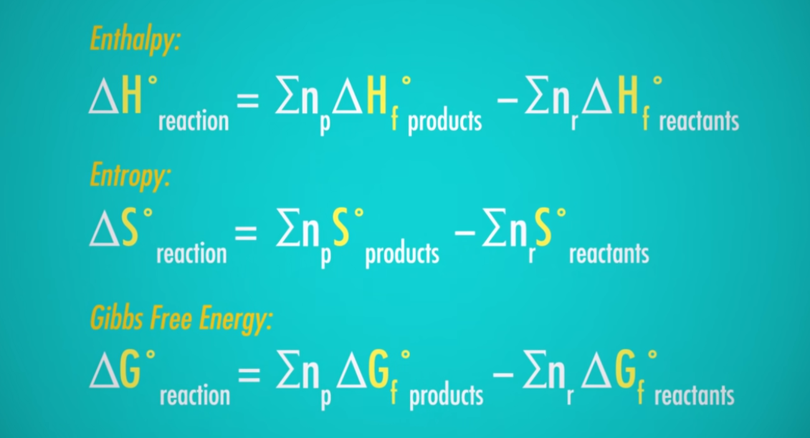
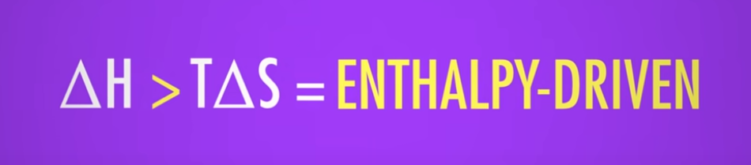
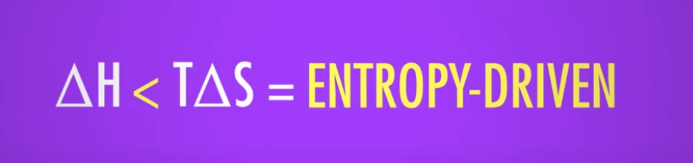

# Unit 1 - Thermochemistry

## Overview

1. Measuring energy changes
2. Hess Law
3. Bond enthalpy
4. Energy cycles
5. Entropy + Gibbs
6. Labs
7. Test :(

---

## Important Images

Most from Crash Course

---

---

## 1.6 Gibbs Free Energy

Nice equations

very cool

---

### Enthalpy Driven

The flow of thermal energy provides most of the free energy in the reaction

- also `Exothermic` (releases heat)

---

### Entropy Driven

Increased disorder provides most of the reactions energy

- also `Endothermic` (absorbs heat)
