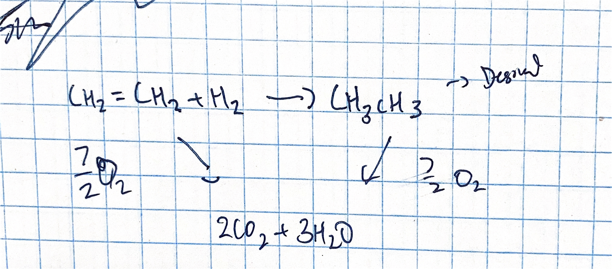

# Hess's Law

## Overview
1. Hess's Law Formula
2. Solving system of equations (for reactions)
3. Enthalpy of formation

---

## Issues with certain reactions
In certain reactions, it is not possible to measure the change in temperature, for instance: `find temp change during combustion of Mg over fire`

    Therefore, Hess's Law lets us calculate for it?

## Formula
> The formula
>
> $\triangle{H_{net}} = \sum \triangle{H_r}$
>
>

## Simple Definition
A statement in chemistry: 

    the heat change in a chemical reaction is the same regardless of the number of stages in which the reaction is effected.

<!-- ## Example
Given a reaction between Mg and fire, the Mg will react to form MgO

`Desired Equation`
1. $Mg + \frac{1}{2}O_2 = MgO$

    - $\triangle{H} = -231.2kJ/mol$

`Given equations`

2. $MgO + 2HCl_{aq} = MgCl_2 + H_{2g}$

    - $\triangle{H} = -95kJ/mol$

3. $2H_2 + O_2 = MgO$
    
    - $\triangle{H} = -422kJ/mol$

`insert`

### [1]
find online ...

 -->

## Example 2
`Desired Equation`

> $ClF + F_2 = ClF_3$

`given equations`
>1. $OF_2 = O_2 + 2F_2$
>       - $\triangle{H} = -49.4kJ/mol$
>2. $ClF+O_2 = Cl_2O + OF_2$
>       - $\triangle{H} = 205.6kJ/mol$
>3. $ClF_3 + O_2 = Cl_2O + OF_2$
>       - $\triangle{H} = 266.7kJ/mol$

`step 1 | reverse the first equation (initial?)`

enthalpy is based off the reaction. Certain molecules will affect and others will not.

[1] $2F_2 + O_2 = 2OF_2$
> $\triangle{H} = 98.8kJ/mol$
>
>not negative anymore bc we swapped/reversed equation

`basically balance out equations | like solving system of equations`

[2] $2ClF + O_2 = Cl_2O + OF_2$
> $\triangle{H} = 416.2kJ/mol$

[3] $Cl_2O + 3OF_2 = 2ClF_3 + 2O_2$
> $\triangle{H} = 533.4kJ/mol$

---

Final equation = [1] + [2] + [3]

[f] $2ClF + 2F_2 = 2ClF_3$
> $\triangle{H} = 845.8kJmol$

# Enthalpy Cycle

Given this image, find the equations - and add the water equation if required. 

`Desired equation`

>$CH_2=CH_2 + H_2$ &rarr; $CH_3CH_3$

`given equations`

>1. $CH_2=CH_2 + O_2$ &rarr; $2CO_2 + 2H_2O$
>       - $\triangle{H} = -1411kJ/mol$
>2. $CH_3CH_3 + \frac{7}{2}O_2$ &rarr; $2CO_2 + 3H_2O$
>       - $\triangle{H} = +1561kJ/mol$x
>3. $H_2 + \frac{1}{2}O_2$ &rarr; $H_2O$
>       - $\triangle{H} = -285.8kJ/mol$

### Goal: Solve the linear system

    Cancel out a bunch of elements

    Sum the enthalpies for each reaction to find final enthalpy.

> Final Equation:
>
> 4. $CH_2=CH_2 + H_2$ &rarr; $CH_3CH_3$
>       - $\triangle{H}=-135.8kj/mol$

# Enthalpy of Formation

>The formula
>
>$\triangle{H}_f = \sum{\triangle{H}_{f,product}} - \sum{\triangle{H}_{f,reactants}}$

## &star; Enthalpy of formation:
    
    Energy required to form a compound; how much energy is added or removed to

- any element in standard form (also includes diatomic gasses)
- assumed that $\triangle{H}_f = 0$

>$2C + 2H_2$ &rarr; $C_2H_4$
>
>- 2C and 2H_2 are both in standard form
>- enthalpy of formation = 0
>- but enthalpy of formation for $C_2H_4$ is not 0; it is `-1411kJ/mol`

## Find the Enthalpy of Formation

>Equation
>
>$C + H_2 + O_2$ &rarr; $C_3H_7OH$
>
>- left side $\triangle{H}_f = 0$
>- find right side
---

>$\triangle{H}_f = -84kJ/mol (CH_3CH_3) - [52kJ/mol (C_2H_4) + 0(H_2)]$
>
>$\triangle{H}_f = \triangle{H}_{f,pro} - \triangle{H}_{f,rea}$
>
>$\triangle{H}_f = -126kJ/mol (C_3H_7OH)$
---

