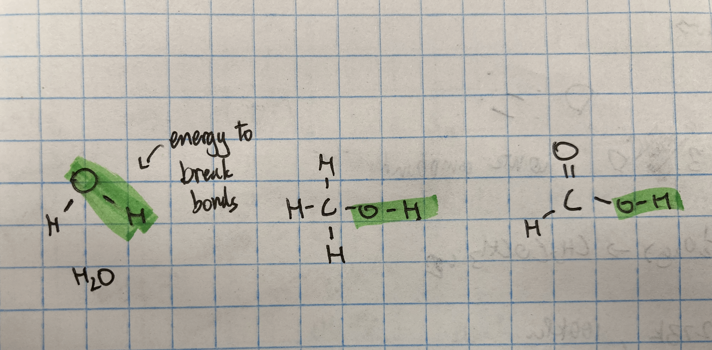

# Bond Enthalpy

---

## Overview

-

## Bond Enthalpy

Bond Enthalpy's are actually `average` values

Enthalpy value will not equal the value from Hess's Law.

The simple answer is (IB):

- the reason why the actual value != theoretical value:
- because the theoretical is an `average` of any type of O-H bond and not just a specific value

> Equation (similar to Formation Enthalpy)
>
> $$\triangle{H} = \sum{\triangle{H}}_{bonds\ broken (reactants)} - \sum{\triangle{H}}_{bonds\ formed(products)}$$

---

## Example

How to solve

Steps:

> 1.  Draw out the bond for any large compounds
>     - bonds affect the enthalpy
> 2.  calculate the bond enthalpy
>     - use the bond enthalpy chart from the `data booklet`
> 3.  use the formula for Bond Enthalpy
>     - $$\triangle{H} = \sum{\triangle{H}}_{bonds\ broken (reactants)} - \sum{\triangle{H}}_{bonds\ formed(products)}$$

## RULES

1. NO CHANGING STATE - all products and reactants should be in same state (like Carbon Monoxide: )
   - $$CO_{(g)}$$&rarr;$$C_{(g)} + O_{(g)}$$
   - not where C is a solid
2. No extra bonds should exist
   - for example: for CO, should not be 1/2 O

> 1.  Draw out the bond for any large compounds
>     - bonds affect the enthalpy
> 2.  calculate the bond enthalpy
>     - use the bond enthalpy chart from the `data booklet`
> 3.  use the formula for Bond Enthalpy
>     - $$\triangle{H} = \sum{\triangle{H}}_{bonds\ broken (reactants)} - \sum{\triangle{H}}_{bonds\ formed(products)}$$
