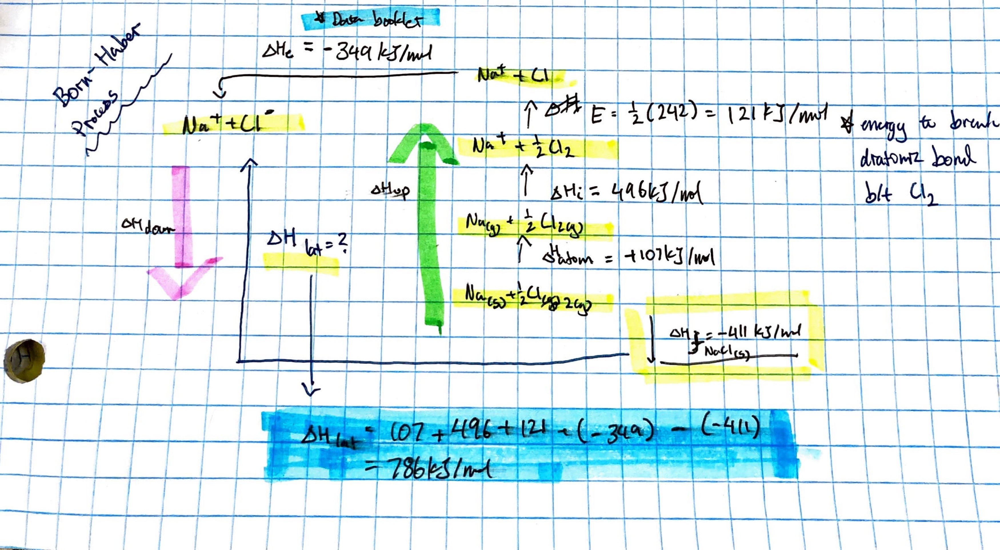
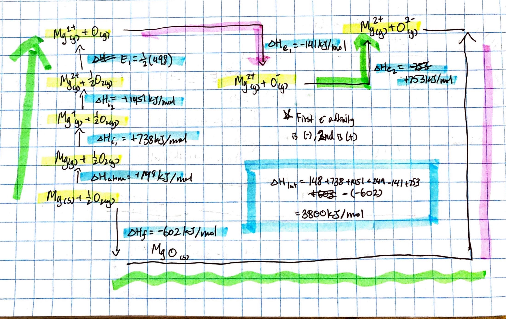

# Lattice Enthalpy

---

# Overview

- What is Lattice Enthalpy
- What we had first
- Lattice Enthalpy Equation for Ionic Reactions
- Enthalpy of Hydration (ionic)

---

## What is Lattice Enthalpy?

Focuses on all types of energy present in a reaction to `form` a compound

$Na + \frac{1}{2}Cl_2$&rarr;$NaCl$

- we are breaking down how to get the end result
- because the reaction is much more complicated than just Na + Cl = NaCl

---

- what must happen to sodium first before it can even react?
- For Na to react with Cl, the metal must ionize (go into a gas state) to electron yeet with Cl

---

    The value of energy required to bring ions together to create a compound

---

## What we had first??

Enthalpy of Atomization

---

## Lattice Enthalpy Equation for Ionic Reactions

$\triangle{H}_{lat} = \triangle{H}_{atomization} + \triangle{H}_i + E + \triangle{H}_e - \triangle{H}_f$

---

> $\triangle{H}_{atomization}$ = solid metal &rarr; gas state
>
> $\triangle{H}_{i/ionization}$ = ionization energy
>
> $E$ = bond enthalpy to break apart non-metals \*coefficents matter
>
> $\triangle{H}_{e/electron affinity}$ = electron affinity
>
> $\triangle{H}_{f/formation}$ = forming the ionic bond

---

- Once Cl has been broken up by bond enthalpy, we move over to electron affinity (break up the Na)

        *First Electron Affinity is Negative (-)
        After that it becomes positive (+)

        Becomes positive because we put in energy to stick e- into metal?

---

## Born-Haber Process

Basically add up all energy required in a reaction that includes everything listed above in the equation of lattic enthalpy:

- solid &rarr; gas
- ionization (for metal)
- electron affinity (for non-metal)
- bond enthalpy
- enthalpy of formation

### Example with NaCl - ionic

yummy

---

### Example with MgO - ionic

---

## Enthalpy of Solutions

All about making (aq) solutions and the energy involved with that

---

$\triangle{H}_{solution}$ &rarr; $\triangle{H}_{lattice} + \triangle{H}_{hydration}$

---

### Magnesium Oxide (ionic hydration)

> $MgO_{(aq)}$ &rarr; $Mg^{2+}_{aq} + O^{2-}_{aq}$
>
> - $= 3800 + (Mg^{2+} + O^{2-})$
>
> - $= 3800 + [-1983 + (-600)]$
>
> - $= 1237 kJ/mol$

---

### Aluminum Chloride (ionic hydration)

$AlCl_{3(aq)}$ &rarr; $Al^{3+}_{aq} + 3Cl^{-}_{aq}$

> $= 2700 + [-4741 + (3 * -359)]
>
> $= -3118kJ/mol$

---
