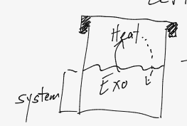
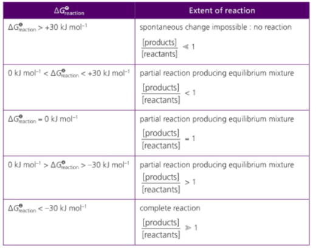
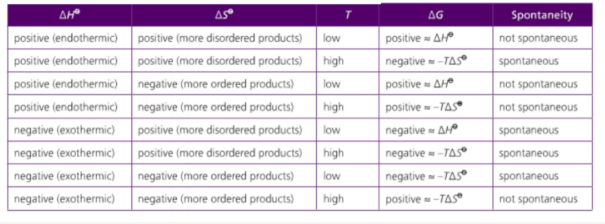

# Gibb's Free Energy

---

## Overview

1. What is it?
2. Units
3. Gibbs Equation
4. Gibbs Equation for Reactions
5. Important Charts for Gibbs
6. Example of solving for T and to check if Spontanteous

---

## Remember

1. Elements in their standard states have $\triangle{G} = 0$

---

## What is it?

BASICALLY &rarr; Left over energy

    THE amount of ENERGY in a system that is AVAILABLE to do USEFUL work
    standard free energy
    free energy of the system

- if we had a reaction that was happening and was exothermic (heat released), heat would be released out of the system.
- if we trap all the heat (isolated system / calorimeter), the heat that is freed in the isolated system can be transferred back into the reaction
- more energy is gone towards completion, more efficiency?
- this can also have a `reverse effect` as the excess energy may reverse the reaction
  - reduces overall effect of the reaction
  - `lower percent yield`

---

### Example in Pop Cans

the gas in pop cans flow circle cycle thing out of solution and back into solution

- this is what keeps the bubbling/carbonated pressure

---

## Units

$\triangle{G} = kJ/mol$

---

## Gibb's Equation

$\triangle{G} = \triangle{H}_{sys} - T\triangle{S}_{sys}$

> sub into the other equation from 1.5 -- Total entropy equation

$\triangle{S}_{total} = \triangle{S}_{sys} + \triangle{S}_{surr}$

> sub the value of $\triangle{S}_{sys}$ into equation

$T*(\triangle{S}_{total} = \triangle{S}_{sys} - \frac{\triangle{H}_{sys}}{T})$

> - if $\triangle{G} < 0$ [is (-)] more spontaneous reactions
>
>   - `more` free energy left over
>
> - if $\triangle{G} > 0$ [is (+)] less spontaneous reactions
>   - `less` free energy left over

---

### Gibbs Equation for Reactions

$\triangle{G} = \sum{\triangle{G}_{fpro}} - \sum{\triangle{G}_{frea}}$

- all elements in their standard states have a $\triangle{G} = 0$
- `similar to enthalpy` $\triangle{H}$

---

## Important Charts - Reaction Liminations due to Gibb's Value

### Reaction Limitations created by Gibbs

### Gibbs and Entropy

---

in change of state $\triangle{G} = 0$ because with no new creation of a product, Gibbs has no real effect

---

## Examples

---

### Find the temp and if the reaction is spontaneous

$C_2H_4 + 3O_2$ &rarr; $2CO_2 + 2H_2O$

> - solve for enthalpy first
>
> $\triangle{H} = \sum{\triangle{H}_{pro}} - \sum{\triangle{H}_{rea}}$
>
> $\triangle{H} = [(2*-393.5) + (2*-231.8)] - [52 - 3(0)]$

$\triangle{H} = -1322.6kJ/mol$

> - solve for entropy next
>
> $\triangle{S} = \sum{\triangle{S}_{pro}} - \sum{\triangle{S}_{rea}}$

$\triangle{S} = [(2*213.8) + (2*188.8)] - [220 + 3*205]$

$\triangle{S} = -29.8 J/molK$

> - solve for gibbs next
>
> $\triangle{G} = \sum{\triangle{G}_{pro}} - \sum{\triangle{G}_{rea}}$

$\triangle{G} = [(2*-394.4) + (2*-228.6)] - [68 + 0]$
$\triangle{G} = -1314kJ/mol$

---

> solve for temperature
>
> $\triangle{G} = \triangle{H} - T*\triangle{S}$

$T = \frac{\triangle{H} - \triangle{G}}{\triangle{S}}$

$T = 288.6K || 15.6K$

$\therefore$ the reaction is spontaneous bc $\triangle{G} = (-)$

---

### What is the temp range of a reaction that has an enthalpy of -426kJ/mol and entropy of 109J/molK

- whenever asked to find the temperature range, we solve two equations
- one where $\triangle{G} = (+)\ and\ (-)$ to find the `max range` where the reaction is `partially reacted`

---

$\triangle{G}$ comes from the table

- we want to find spontanenous and non-spontaneous

$\triangle{G} = +30kJ/mol$
$\triangle{G} = -30kJ/mol$

> SOLVING for 1st equation

$T = \frac{\triangle{H} - \triangle{G}}{\triangle{S}}$

$T = \frac{-426 - 30}{0.109}$

$T = 3633K$

> SOLVING for 2nd equation

$T = \frac{triangle{H} - \triangle{G}}{\triangle{S}}$

$T = \frac{-426 - (-30)}{0.109}$

$T = 4183K$

> range

3633K ~ 4183K
