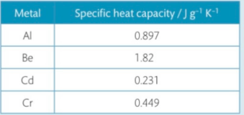
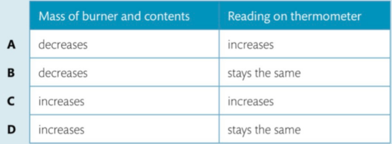
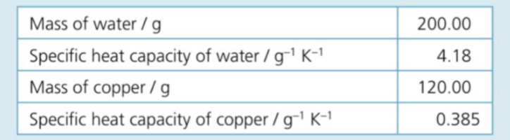
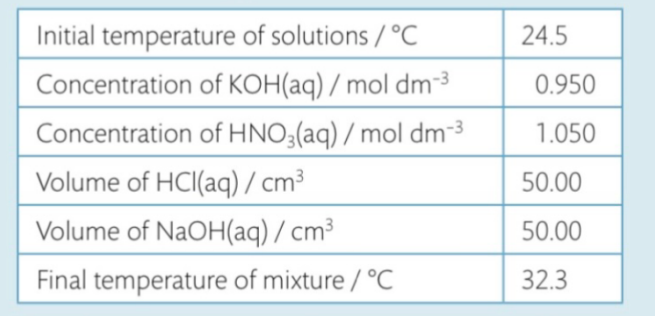

# Homework

## 1

> When a sample of $NH_4SCN$ is mixed with a solid $Ba(OH)_2\dot{}8H_2O$ in a glass beaker, the mixutre changes to a liquid and the temperature drops to freeze the beaker to the table. What statement is true about the reaction?

- A | the process is endothermic and $\triangle{}H$ is -

## 2

> Which one of the following statements is _true_ for all exothermic reactions?

- B | they give out heat

## 3

> If 500K of heat is added to 100.0g samples of each of the substances below, which will have the largest temperature increase?

- A | gold $-$ lowest specific heat capacity results in lower $J/g^{-1}K^{-1}$

## 4

> The temperature of a 5.0g sample of coppoer increases from $27^\circ{}C$ to $29^\circ{}C$. Calculate how much heat has been added to the system. (Specific heat capacity of $Cu = 0.385Jg^{-1}K^{-1}$)

m = 5.0g
c = 0.385J/gK

$\triangle{T} = 29-27 = 2$

$\therefore{} \triangle{H} = c*m*\triangle{T} = 3.85J$

- D

## 5

> Consider the heat capacity of the following metals
>
> 
>
> 1kg samples of each metal at room temp is heated by the same source for 10 min. Identify the metal with the highest final temperature.

- Cd | same reasoning as q2

## 6

> The specific heat of metallic mercury is $0.138Jg^{-1}K^{-1}$. If 100.0J of heat is added to a 100.0g sample of mercury at $25.0^\circ{}C$, what is the final temperature of the mercury?

m = 100.0g
c = 0.138K/gK
$\triangle{T}$ = ?
$\triangle{H}$ = 100.0J

$\triangle{H} = mc\triangle{T}$

$\triangle{H} = 100.0g * 0.138J/gK * \triangle{}T$

$\triangle{T} = 7.246K$

> substance is heated $\therefore$ H < 0

$T_f = T_i + 7.25 = 32.35^\circ{}C$

- The substance is now 32.35C

## 7

> The mass of the burner and its content is measured before and after the experiment. The thermometer is read before and after the experiment. What are the expected results?
>
> 

- B

## 8

> The experimental arragment in Figure 5.7 is used to determine the enthalpy of combustion of an alcohol. Which of the following would lead to an experimental result which is **less** exothermic than the literature value?
>
> - Heat loss from the sides of the copper calorimeter
> - Evaporation of alcohol during the experiment
> - The thermometer touches the bottom of the calorimeter

- B | thermometer and heat loss = losing heat; evaporation lowers mass

## 9

> A copper calorimeter was used to determine the enthalpy of combusion of butan-1-ol. The experimental value was -2100 $\pm$ 200 kJ/mol and the data booklet value is -2676 jK/mol. Which of the following accounts for the difference between the two values?
>
> - random measurement errors
> - incomplete combustion
> - heat loss to the surroundings

- C

## 10

> 1.10g of glucose was completely burnt in a copper calorimeter. The temperature of the water increased from 25.85C to 26.50C

> a) Calculate the enthalpy of combustion of glucose from the data below:
> 

$\triangle{H} = -mc\triangle{T}$

$H = (200.00g*4.18J/gK + 120.00g*0.385gK)*\triangle{T}$

$\triangle{T} = 36.50-25.85= 10.65C$

$H = 9395.43J$

- The enthalpy of the combustion is 9395.43J

> b) Draw an enthalpy level diagram to represent this reaction...
> wth is an enthalpy level diagram????

## 11

> The heat released from the combustion of 0.0500g of white phosphorus increases the temperature of 150.00g of water from 25.0C to 31.5C. Calculate the average for the enthalpy change of combustion of phosphorus. List possible sources of error in the experiment.

$\triangle{T} = 31.5-25.0= 6.5C$

$\triangle{H} = mc\triangle{T}$

$H = 150.00g * 4.18J/gK * 6.5C$

$H_{avg} = \frac{4075.5}{6.5}$

$H_{avg-P_4} = 81.5kJ/g$

- the enthalpy change is 630kJ

## 12

no information given

## 13

> Calculate the enthalpy of neutralization based on the following data.
>
> 
