# Unit 1 - Idek at this point physic is weird

## Overview

1. Rotational Kinematics
2. Substract Vectors
3. Centripetal Acceleration
4. Polar Coordinates
5. Newton's Second Law in Polar Systems + Banked Curves
6. Apparent Weight
7. Artifical Gravity
8. Work and Energy

---

## Rotational Kinematics

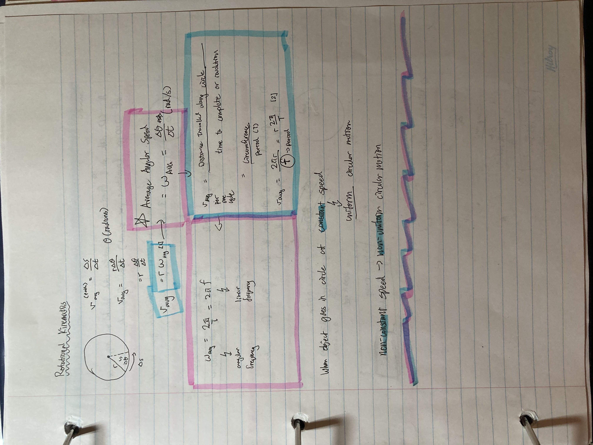
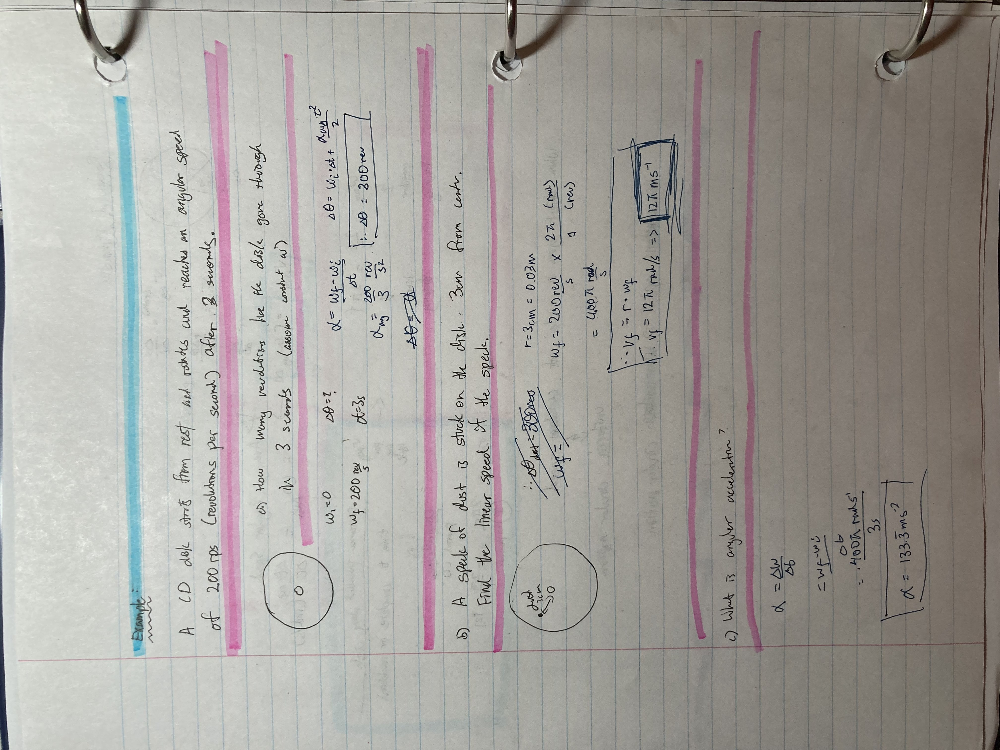

---

## Subtracting Vectors

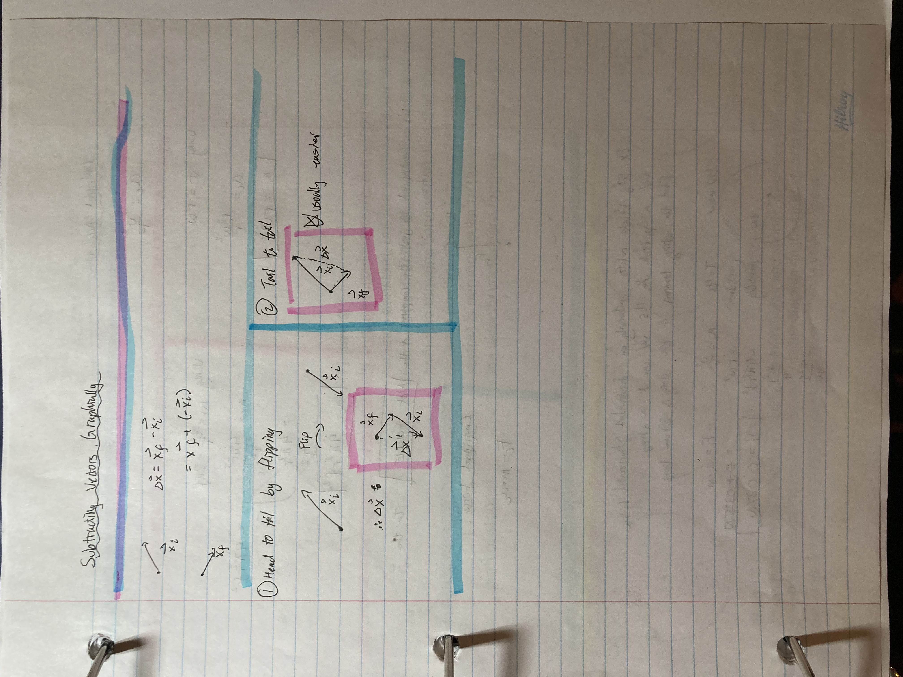

---

## Centripetal Acceleration

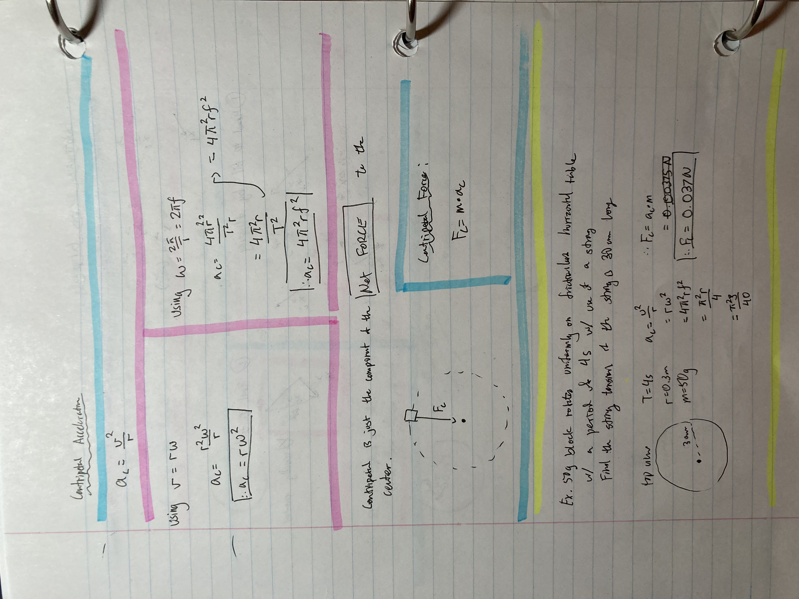

---

## Polar Coordinates

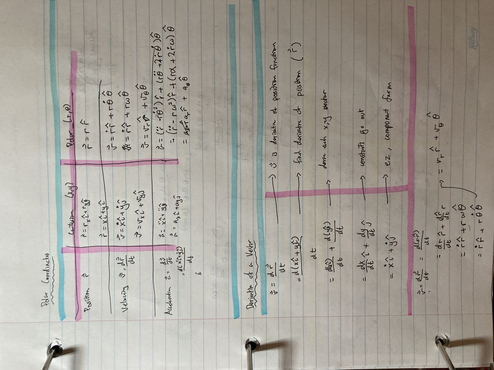
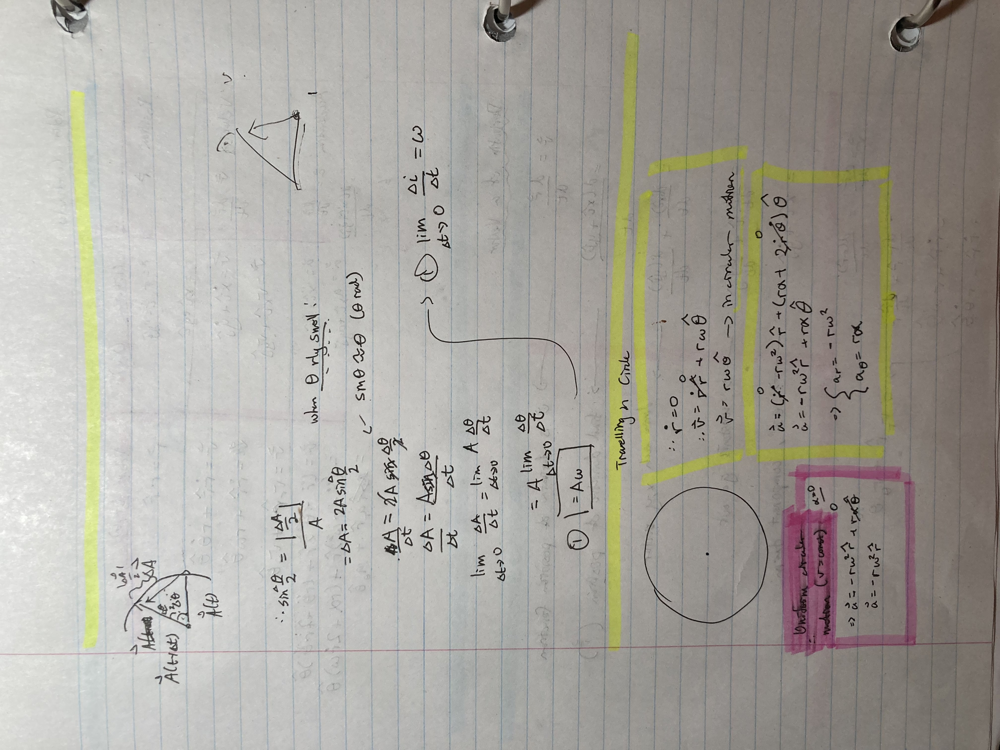

---

## Newton's Second Law in Polar Systems + Banked Curves

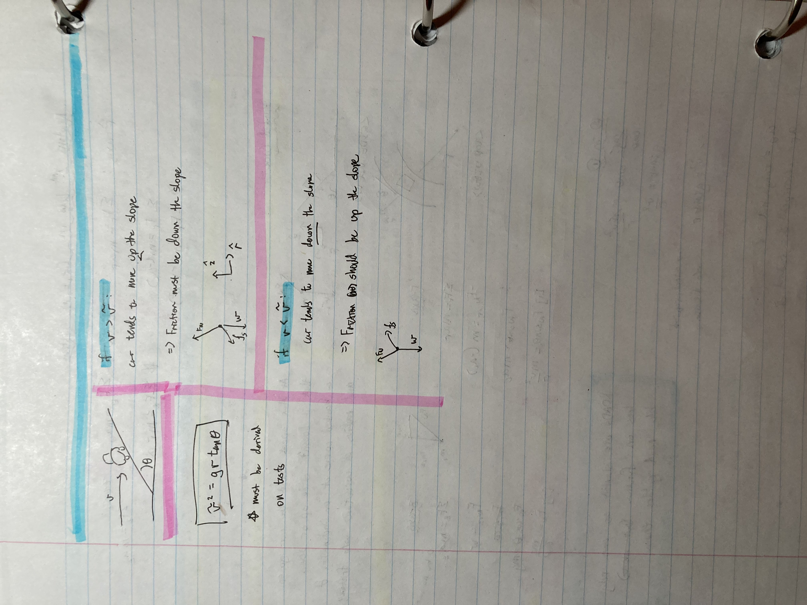

---

## Apparent Weight

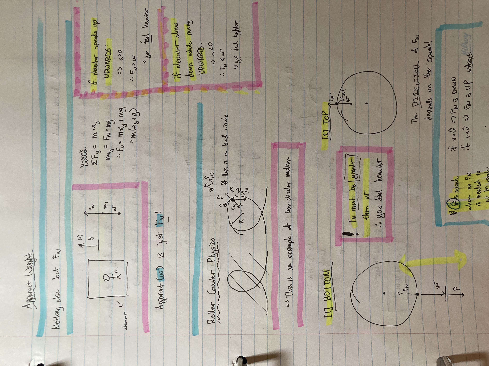
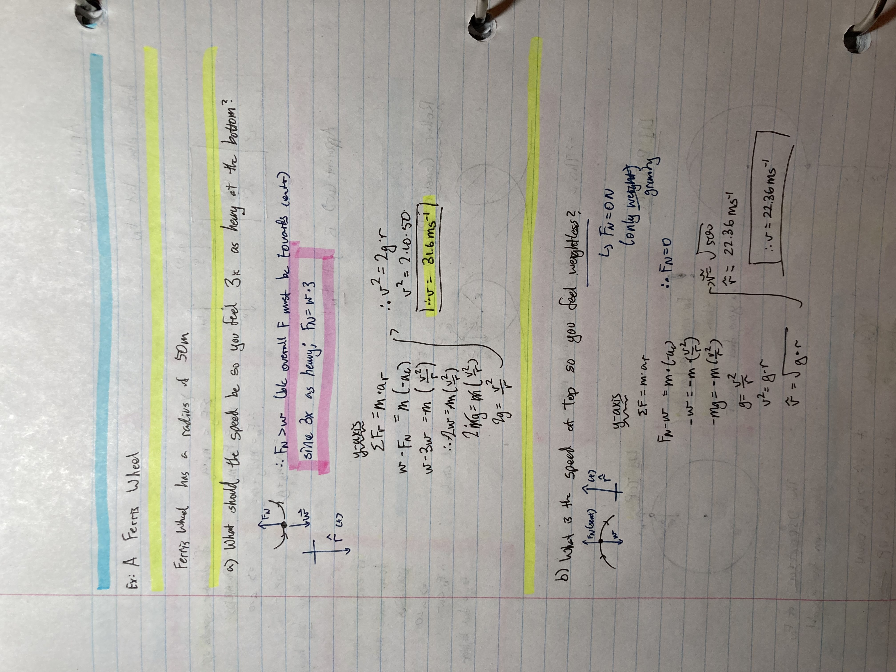

---

## Artificial Gravity

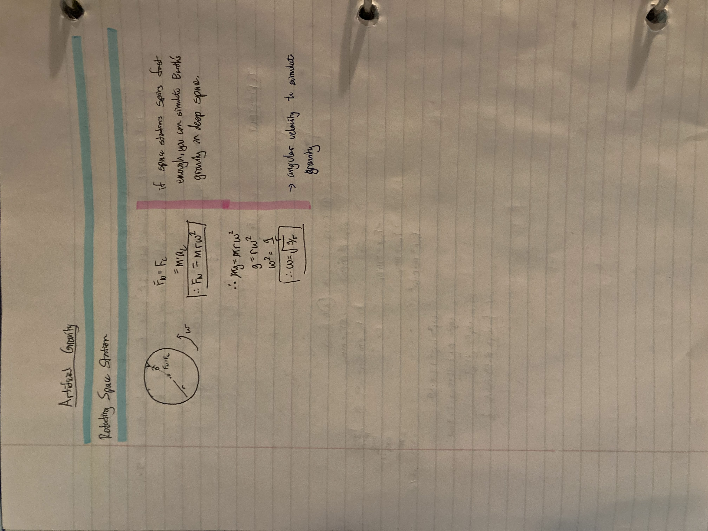

---

## Work and Energy

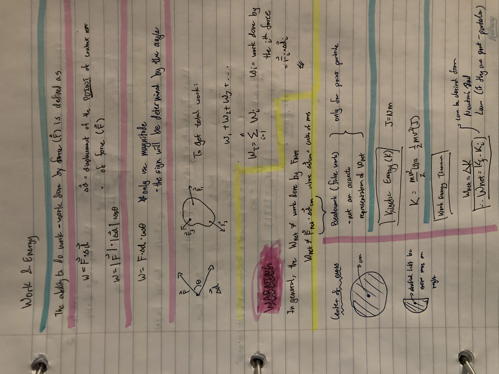
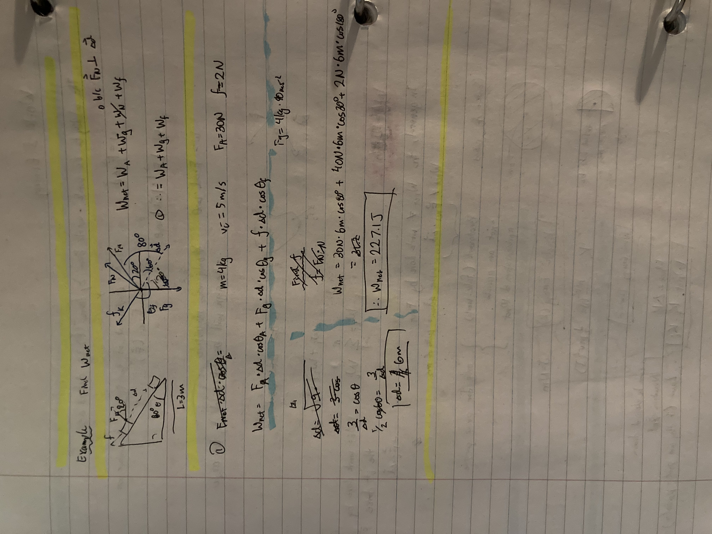
